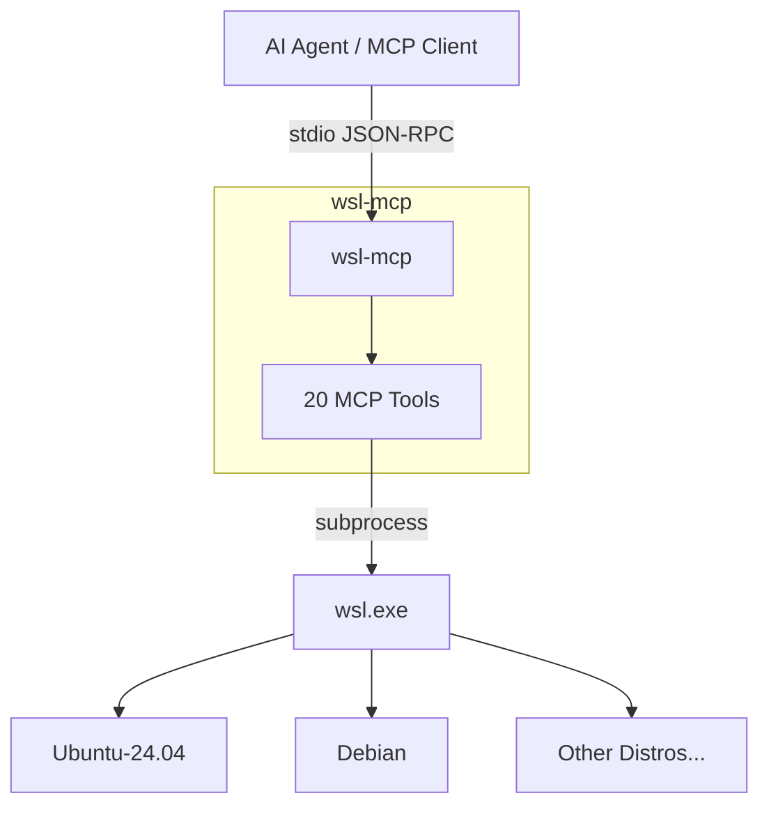

# wsl-mcp

[](https://github.com/aniongithub/wsl-mcp/actions/workflows/ci.yml)

**Give your AI agent access to WSL — safely, through MCP tools.**

`wsl-mcp` is an MCP server that lets AI coding agents create, manage, and work inside [WSL](https://learn.microsoft.com/en-us/windows/wsl/) distributions. The agent runs commands, edits files, and manages distros through structured MCP tools — no raw shell access to your Windows host.

> Works with **GitHub Copilot**, **Claude**, **Cursor**, and any MCP-compatible client.

## The Problem

When AI agents work on Windows with WSL, they struggle with:

- 🔴 **Wrong environment** — agents run commands on the Windows host instead of inside WSL
- 🔴 **No distro awareness** — agents don't know which WSL distros are available
- 🔴 **Unstructured access** — raw `wsl.exe` calls with no lifecycle management
- 🔴 **File boundary confusion** — agents mix up Windows and WSL filesystem paths

## The Solution

`wsl-mcp` exposes **20 MCP tools** that let any AI agent:

1. **Discover and manage** WSL distributions — list, install, import/export, set defaults
2. **Run commands** inside any distro — builds, tests, package management
3. **Read, write, and edit files** inside WSL filesystems
4. **Control the WSL subsystem** — terminate distros, shut down WSL, check disk usage

```
Agent: "Let me build this project..."
  → wsl_list() → sees Ubuntu-24.04 is available
  → wsl_exec(distro: "Ubuntu-24.04", command: "cargo build")
  → wsl_file_read(distro: "Ubuntu-24.04", path: "/home/user/project/src/main.rs")
  → ✅ Everything happens inside WSL. Windows host untouched.
```

## Architecture



## MCP Tools (20 total)

### Distro Management (8 tools)

| Tool | Description |
|------|-------------|
| `wsl_list` | List all installed distributions with state and version |
| `wsl_status` | Get detailed status of a specific distribution |
| `wsl_install` | Install a new distribution from the Microsoft Store |
| `wsl_unregister` | Unregister (delete) a distribution — destructive |
| `wsl_set_default` | Set the default distribution |
| `wsl_import` | Import a distribution from a tar file |
| `wsl_export` | Export a distribution to a tar file |
| `wsl_available` | List distributions available from the store |

### Command Execution (3 tools)

| Tool | Description |
|------|-------------|
| `wsl_exec` | Execute a command inside a distribution |
| `wsl_shell` | Execute in a login shell (loads .bashrc, .profile, etc.) |
| `wsl_exec_batch` | Run multiple commands sequentially, stop on first failure |

### File Operations (4 tools)

| Tool | Description |
|------|-------------|
| `wsl_file_read` | Read file content with optional line range |
| `wsl_file_write` | Create or overwrite a file (auto-creates parent dirs) |
| `wsl_file_edit` | Surgical string replacement — old_str → new_str |
| `wsl_file_list` | List directory contents (non-hidden, 2 levels deep) |

### Configuration & Info (5 tools)

| Tool | Description |
|------|-------------|
| `wsl_terminate` | Terminate a running distribution |
| `wsl_shutdown` | Shut down the entire WSL subsystem |
| `wsl_set_version` | Set WSL version (1 or 2) for a distribution |
| `wsl_system_info` | Get WSL system information |
| `wsl_disk_info` | Get disk usage for a distribution |

## MCP Server Configuration

```json
{
  "mcpServers": {
    "wsl-mcp": {
      "command": "wsl-mcp",
      "args": ["serve"]
    }
  }
}
```

## Prerequisites

- **WSL 2** — install with `wsl --install` if you haven't already
- At least one WSL distribution installed

## Self-Healing

When `wsl_install` or `wsl_exec` fails, the full output (including errors) is returned to the agent. The agent can read the error, fix the issue, and retry — making the WSL environment a **dynamic, agent-managed asset**.

## Development

This project eats its own dogfood — development happens inside its own devcontainer.

```bash
devcontainer up --workspace-folder .
devcontainer exec --workspace-folder . cargo build --workspace
devcontainer exec --workspace-folder . cargo test --workspace
```

### CI/CD

- **Pull Requests** — `cargo check`, `cargo test`, `cargo clippy`, `cargo fmt` run automatically
- **Releases** — Creating a GitHub release builds binaries for Windows (x64, arm64) and Linux (x64, arm64)

## License

[MIT](LICENSE)
An MCP that allows AI coding agents to work directly inside WSL distros
